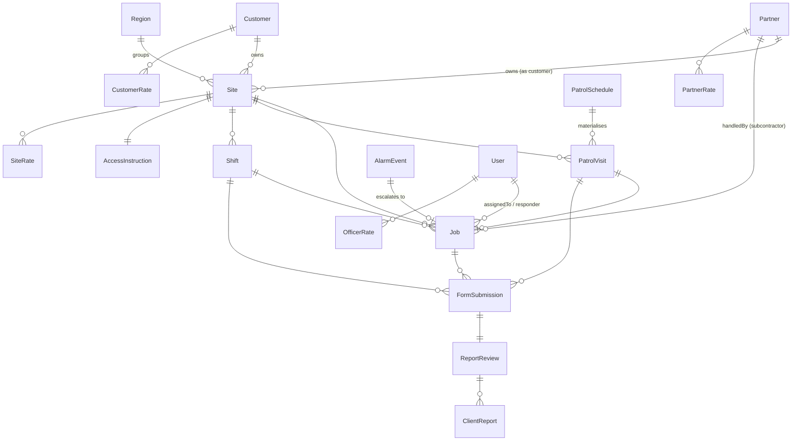

# Data Model

> The complete Prisma/Postgres schema for 1st Nationwide Ops (`prisma/schema.prisma`, "v1.2") — **40 models and 37 enums** on Supabase Postgres (EU-West). Schema changes ship as SQL migrations under `prisma/migrations/`, applied on every Vercel deploy by `prisma migrate deploy` (build command in `CLAUDE.md`); **any edit to `schema.prisma` requires a matching, timestamp-named migration** or the deployed app crashes with P2022/P2010.

Source of truth: `prisma/schema.prisma`. This document is a reference; field-level comments in the schema carry the authoritative business semantics.

---

## Conventions

| Concern | Rule |
| --- | --- |
| **Primary keys** | UUID everywhere — `String @id @default(dbgenerated("gen_random_uuid()")) @db.Uuid` (Postgres `pgcrypto`). **Exception: `Region.id` is `Int @default(autoincrement())`**, so every `regionId` FK is an `Int`, not a UUID. `OfficerAvailability`/`RotaAssignment` use `gen_random_uuid()` too. |
| **Timestamps** | `createdAt DateTime @default(now())` on nearly all models; `updatedAt DateTime @updatedAt` on mutable entities. Some rows carry domain time anchors instead of/alongside these (`KeyMovement.occurredAt`, `AlarmEvent.receivedAt`, `FormSubmission.submittedAt`, `Notification.sentAt`). Date-only columns use `@db.Date` (`OfficerAvailability.date`, `RotaAssignment.date`). |
| **Soft delete / active flags** | No hard deletes for core entities. `active Boolean @default(true)` on `User`, `Customer`, `Site`, `KeySet`, `Partner`, `PartnerOfficer`, `PatrolSchedule`, `LockUnlockSchedule`, `FormTemplate`, `FormBlueprint`, `JobTypeOption`, `JobSourceOption`. `Key` uses `status` (KeyStatus) instead. Cancellations are reversible: `Job` and `PatrolVisit` keep `cancelledAt`, `cancelledByUserId`, and `statusBeforeCancel` so Restore returns the row to where it was. |
| **Money** | `Decimal @db.Decimal(10,2)` for amounts; per-minute excess rates use `Decimal @db.Decimal(10,4)`. Always paired with a `currency String @default("GBP")`. Amounts are **snapshotted** onto activity rows at completion (see `09-finance-billing-pay.md`), never computed live from the rate cards. |
| **Enums** | Native Postgres enums (35 of them). Two enums (`JobType`, `JobSource`) additionally have DB-backed label tables (`JobTypeOption`, `JobSourceOption`) so admins can rename/reorder/alias options without a deploy. |
| **JSON columns** | `Json` for flexible payloads: `FormSubmission.payload`, `FormTemplate.fields`, `FormBlueprint.fields`, `ReportReview.edits`, `ActivityLog.diff`, `Notification.templateParams`, `TelegramCalloutDraft.payload`, `CallEvent.payload`. |
| **Case-insensitive text** | `citext` extension; `User.email` is `@db.Citext @unique` (case-insensitive login). |
| **Encryption of codes** | `AccessInstruction.alarmCodeEnc` / `padlockCodeEnc` are `Bytes?` — AES-256-GCM ciphertext via `src/lib/crypto.ts` (`[12-byte IV][16-byte tag][ciphertext]`, key in `ENCRYPTION_KEY`, base64 32 bytes). Legacy plaintext columns `alarmCode` / `padlockCode` still exist; `decryptString` tolerates legacy plaintext during the migration window. Writing sensitive data with no key set throws (refuses to store plaintext). |
| **Extensions** | `pgcrypto`, `citext` (declared on the datasource); preview features `postgresqlExtensions`, `fullTextSearch`. |
| **Arrays** | Postgres scalar-list columns e.g. `Site.services ServiceTag[]`, `PatrolSchedule.timesOfDay String[]`, `PatrolVisit.photoUrls String[]`, `LockUnlockSchedule.days DayOfWeek[]`. |

---

## Entity groups

### Identity & access

#### User
Every human (and partner seat) that can log in or be assigned work.
- `email` — Citext, unique — login id. `passwordHash` — nullable — bcrypt; null for accounts that never sign in (roster-only, token-only duty).
- `role` — `UserRole` — ADMIN / DISPATCHER / OFFICER / PARTNER / PARTNER_OFFICER; drives middleware routing.
- `siaNumber` — unique nullable — SIA licence.
- `regionId` — Int? — officer's home region (`OfficerRegion` relation).
- `onDuty`, `lastLat`, `lastLng`, `lastSeenAt` — live presence for dispatch.
- `telegramChatId` (unique), `telegramLinkCode` (unique), `telegramLinkExpires`, `pendingLocationJobId` — Telegram bot linking + location-share handshake.
- `partnerId` — UUID? — set only for `PARTNER`/`PARTNER_OFFICER`; the partner portal hard-scopes every query to this id.
- Relations: huge fan-out — leads regions, holds keys, is responder on jobs, submits forms, reviews reports, authors templates/blueprints, owns officer rates, works shifts, has rota availability/assignments, and (1:1) backs a `PartnerOfficer` seat via `partnerOfficerSeat`.
- Indexes: `@@index([regionId, role])`, `@@index([partnerId])`.

#### Region
Operating region (London, etc.); the only `Int`-keyed model.
- `name` unique; `leadUserId` → `User` (`RegionLead`); `notes`.
- Relations: `sites`, `officers` (`OfficerRegion`), `rotaAssignments`.

#### OfficerAvailability
Officer-set availability for a UK date + half-day shift. Existence = available.
- `officerId`, `date @db.Date`, `shift RotaShift`, `notes`.
- `@@unique([officerId, date, shift])`, `@@index([date, shift])`. Cascade-deletes with the officer.

#### RotaAssignment
Dispatcher-set "officer X is on for region R, date D, shift S".
- `date @db.Date`, `shift RotaShift`, `regionId`, `officerId`, `notes`, `createdByUserId`.
- `@@unique([date, shift, regionId, officerId])` (multiple officers per region+shift allowed); indexes on `[officerId, date]`, `[regionId, date, shift]`.

### Customers & sites

#### Customer
A direct billing customer (Shurgard, Aegis, Orbis…).
- `name` unique; `type CustomerType`; contact + billing fields; `contractRef/Start/End`.
- `smsAlertsOn Boolean @default(false)` — opt-in gate for alarm-response SMS acks (never text without consent).
- Relations: `sites`, `jobs`, `contacts`, `formTemplates`, `rates` (`CustomerRate`).

#### CustomerContact
Named contacts under a customer (site manager, ARC desk…).
- `customerId` (cascade), `name`, `role?`, `email?`, `phone?`, `ref?`, `notes?`.

#### Site
The central spine entity — a guarded location.
- `code` unique?, `name`, `addressLine`, `postcode`, `postcodeFormatted`, `city?`, `lat/lng?`.
- `geofenceRadiusM Int?` — per-site override for shift GPS matching (null → app default 300 m).
- `type SiteType`, `regionId Int?`, `customerId?`, **`partnerId?`** (partner-as-customer sites — e.g. Nexus's London sites), `defaultResponderId?` → User.
- `services ServiceTag[]`, `riskLevel RiskLevel`, `active`.
- Partner-supplied metadata block: `partnerReference`, `partnerSin`, `sapRef`, `opsUnit`, `what3words`, `partnerStatus`, `startDate`, `terminationDate`, `dne Boolean`, `hsMarkers Boolean`.
- Relations: keys, keySets, `accessInstruction` (1:1), patrol/lockunlock schedules, patrol visits, alarm events, onboarding pipelines, jobs, form submissions, form templates, `rates` (`SiteRate`), shifts.
- Indexes: region, customer, partner, postcode, type, active, partnerReference.

### Keys

#### KeySet
A physical bunch of keys for a site.
- `siteId` (cascade), `internalNo?` unique, `label`, `notes?`, `photoUrl?` (Vercel Blob reference photo), `active`.
- Relation: `keys`.

#### Key
An individual key/fob/padlock/code.
- `internalNo?` unique, `label`, `type KeyType`, `siteId?`, `keySetId?` (SetNull), `copyOfId?` (self-relation `KeyCopies`, SetNull), `duplicable Boolean`.
- `currentHolderUserId?` → User (`KeyHolder`), `status KeyStatus @default(WITH_US)`, `qrId?` unique.
- Relation: `movements`. Indexes on site, keySet, copyOf, holder, status.

#### KeyMovement
Chain-of-custody log for one key.
- `keyId` (cascade), `fromUserId?`, `toUserId?`, `occurredAt`, `reason?`, `notes?`, `signedOffById?`.
- `@@index([keyId, occurredAt])`.

#### AccessInstruction
1:1 per site — how to get in (sensitive).
- `siteId` unique (cascade); `alarmCodeEnc Bytes?`, `padlockCodeEnc Bytes?` (encrypted); legacy plaintext `alarmCode?`, `padlockCode?`; `entryStepsMd?`, `lockboxId?`, `hazards?`; `updatedAt`, `updatedBy?`.

### Scheduling

#### PatrolSchedule
Recurring patrol or VPI template for a site.
- `siteId` (cascade), `kind ScheduleKind` (PATROL|VPI), `dayOfWeek`, `frequency PatrolFrequency`.
- `timeOfDay String?` (legacy single "HH:MM" UK wall-clock) + `timesOfDay String[]` (multiple times/day → one visit each; earlier-than-previous means crosses midnight).
- `intervalWeeks Int?` — custom "every N weeks" overriding `frequency`. `exceptionDates String[]` — per-schedule skip dates ("YYYY-MM-DD").
- `assignedOfficerId?` **XOR** `handledByPartnerId?` (`PatrolSchedulePartner`) — subcontracted patrols; `partnerFillsOwnApp Boolean` copied onto each visit.
- `active`, `startsOn?`, `endsOn?`. Relation: `visits`.

#### PatrolVisit
A materialised patrol/VPI occurrence (created nightly by cron).
- `siteId`, `patrolScheduleId?`, `officerId?`, `handledByPartnerId?` (`PatrolVisitPartner`), `reportedViaPartnerApp Boolean` (no `/submit`, no ClientReport).
- `scheduledAt`, `scheduleDate?` (UK-midnight accounting anchor; overnight visits stay grouped under the night they started).
- Cancellation audit: `cancelledAt?`, `cancelledByUserId?`, `statusBeforeCancel VisitStatus?`.
- Execution: `arrivedAt?`, `departedAt?`, `lat/lng?`, `locatedAt?`, `status VisitStatus`, `gpsLat/gpsLng?`, `photoUrls String[]`, `notes?`.
- **Finance snapshot**: `billedAmount/Currency/At`, `paidAmount/Currency/At`, `payRateUnit`, plus `partnerChargeToUsAmount`/`partnerOfficerPayAmount` (subcontracted visits) and `invoiceId` (once invoiced).
- Relations: `job` (1:1 back), `formSubmissions`. Indexes on `[siteId, scheduledAt]`, `[officerId, scheduledAt]`, partner, status.

#### LockUnlockSchedule
Daily lock-up / unlock timing for a site.
- `siteId` (cascade), `unlockTime?`, `lockdownTime?` ("HH:MM"), `days DayOfWeek[]`, `assignedOfficerId?`, `active`.

### Jobs, alarms & shifts

#### Job
The universal unit of dispatched work — alarm response, patrol, lock/unlock, key run, survey, VPI, ad-hoc, or a guarding/dog shift link.
- `type JobType`, `typeLabel?` (operator's chosen alias label), `source JobSource`, `status JobStatus`, `priority AlarmPriority`.
- Account (all nullable — **a Job may have only a Partner, or neither**): `siteId?`, `customerId?`, `partnerId?` (partner-as-customer, mirrors `Site.partnerId`), `onboardingPipelineId?`.
- Responder: `responderType ResponderType?`, `assignedToUserId?` (internal), `externalResponder?`.
- **Partner-as-subcontractor** (we sub the work out): `handledByPartnerId?` (`JobHandlerPartner`), `handledByPartnerOfficerId?`, `partnerChargeToUsAmount Decimal?`, `partnerOfficerPayAmount Decimal?`, `recordedByPartner Boolean`, `handedOffAt?`, `lastPartnerChaseAt?` (drives the 15-min chase cadence).
- Links (each unique): `alarmEventId?`, `patrolVisitId?`; plus `shiftId?` (SetNull).
- Lifecycle: `scheduledFor?`, `startedAt?`, `completedAt?`, `lat/lng?`, `locatedAt?`; cancel audit `cancelledAt?`/`cancelledByUserId?`/`statusBeforeCancel?`.
- Reporting flags: `reportedViaPartnerApp Boolean` (partner-app job → no ClientReport), `partnerReportRef?`, `recordedByUserId?` (dispatcher-typed → lands APPROVED), `excludeFromClientReport Boolean`.
- **Finance snapshot**: `billedAmount/Currency/At`, `paidAmount/Currency/At`, `payRateUnit`, `partnerChargeToUsAmount`/`partnerOfficerPayAmount` (partner-handled), and `invoiceId` (once invoiced).
- Relation: `formSubmissions`. Many indexes incl. `[siteId, status]`, `[assignedToUserId, status]`, customer, partner, handler, pipeline, scheduledFor, status, shift.

#### AlarmEvent
A raw inbound alarm activation, before/with a Job.
- `siteId`, `source AlarmSource`, `receivedAt`, `rawSubject?`, `rawBody?`, `zone?`, `priority AlarmPriority`, `assignedToId?`, `outcome AlarmOutcome?`, `closedAt?`, `notes?`.
- 1:1 `job` back-relation. Indexes `[siteId, receivedAt]`, assignedTo, priority.

#### OnboardingPipeline
A site's go-live pipeline for a program (Tesco/Shurgard).
- `siteId` (cascade), `program CustomerProgram`, `stage OnboardingStage`, `targetGoLiveDate?`, `cancelReason?`, `notes?`. Relation: `jobs`.

#### Shift
A static-guarding or dog-handler duty period (own lifecycle, its own finance snapshot).
- `siteId`, `officerId?`; partner variant: `handledByPartnerId?` (`ShiftHandlerPartner`), `handledByPartnerOfficerId?`, `partnerChargeToUsAmount?`, `partnerOfficerPayAmount?`, `recordedByPartner`.
- `type ShiftType`, `scheduledStartsAt/EndsAt`, `actualStartedAt?/EndedAt?`, `status ShiftStatus`, `checkIntervalMin @default(60)`, `graceMinutes @default(15)`.
- Duty link (public, login-free): `publicToken?` unique, `officerNameRaw?`, `linkPhone?`.
- GPS at start/end: `startLat/Lng`, `startGpsAccuracy`, `startDistanceM`, `startWithinGeofence?` (+ matching `end*`).
- `endedLate Boolean`, `lateReason?`, `payableMinutes Int?` (worked minutes rounded **up** to the next 30-min block — the pay basis).
- **Finance snapshot**: `billedAmount/Currency/At`, `paidAmount/Currency/At`, `payRateUnit`, `partnerChargeToUsAmount`/`partnerOfficerPayAmount` (paid stays null for partner-handled — cost lives on the partner columns), and `invoiceId` (once invoiced).
- Relations: `formSubmissions`, `jobs`. Indexes on `[siteId, scheduledStartsAt]`, `[officerId, scheduledStartsAt]`, partner, status.

#### JobTypeOption
Admin-managed labels/ordering for the `JobType` enum (rename, hide, reorder, add alias labels without a deploy).
- `code JobType`, `label`, `description?`, `sortOrder Int`, `active`. First active option per code = canonical display label.

#### JobSourceOption
Same pattern for the `JobSource` enum (`code JobSource`, `label`, `sortOrder`, `active`).

### Forms & reports

#### FormSubmission
An officer's completed activity form (the `/submit` payload).
- `form SubmissionForm`, `formTemplateId?` (SetNull), links `siteId?`/`jobId?`/`patrolVisitId?`/`shiftId?` (all SetNull).
- `submittedByUserId?`, `officerNameRaw`, `arrivedAt?`, `departedAt?`, `payload Json`, `submittedAt`.
- 1:1 `review` (`ReportReview`). Indexes on `[siteId, submittedAt]`, job, submitter, form, template, visit, shift.

#### FormTemplate
A scoped, customisable form definition.
- `name`, `jobType SubmissionForm?`, `scope TemplateScope` (GLOBAL/CUSTOMER/PARTNER/SITE), scope FKs `customerId?`/`partnerId?`/`siteId?` (cascade), `fields Json`, `active`, `blueprintId?` (SetNull), `createdById?`.
- Relation: `submissions`. Index `[scope, jobType, active]`.

#### FormBlueprint
A reusable, versionable base a template is derived from.
- `slug` unique, `name`, `description?`, `jobType?`, `fields Json`, `source?`, `builtin Boolean`, `active`, `createdById?`. Relation: `templates`.

#### ReportReview
Admin review record for a submission before it reaches the client.
- `submissionId` unique (cascade), `status ReviewStatus`, `reviewerId?`, `reviewedAt?`, `edits Json?`, `reviewerNotes?`.
- Relation: `clientReports`. Index `[status, createdAt]`.

#### ClientReport
An outbound client report (email/portal/WhatsApp) generated from an approved review.
- `reviewId` (cascade), `channel ReportChannel`, `toAddress`, `subject?`, `pdfUrl?`, `status ReportStatus`, `sentAt?`, `failureReason?`.

### Finance & rates
See `09-finance-billing-pay.md` for the full billing/pay logic.

#### SiteRate
Per-site customer-facing price override. `siteId` (cascade), `service RateService`, `amount Decimal(10,2)`, `currency`, `unit RateUnit`, `includedMinutes Int?`, `excessRatePerMin Decimal(10,4)?`, `validFrom/To?`, `notes?`, `source?`. `@@unique([siteId, service])`.

#### CustomerRate
Customer-level **default** rate card — same shape as `SiteRate`, keyed `@@unique([customerId, service])` (cascade). A `SiteRate` for the same service overrides it (site wins).

#### OfficerRate
What we **pay** an officer per service. `officerId?` (null = company default), `service`, `amount`, `unit`, `includedMinutes?`, `excessRatePerMin?`, `validFrom/To?`. `@@unique([officerId, service])`. Per-officer beats company default. A `PER_MONTH` / `ANNUAL_SUBSCRIPTION` row is treated as the monthly retainer by payroll.

#### PartnerRate
Partner rate card — both sides in one row. `partnerId` (cascade), `service`, `chargeToUs Decimal(10,2)`, `payToOfficer Decimal(10,2)`, `currency`, `unit`. `@@unique([partnerId, service])`. Auto-fills partner-recorded activity finance fields (and subcontracted patrol visits, snapshotted at materialisation).

#### Invoice
A customer invoice for a period (added). `number` unique (`INV-#####`), `customerId`, `status InvoiceStatus` (DRAFT/SENT/PAID/VOID), `periodFrom/To`, `issuedAt?`, `dueAt?`, `subtotal`/`vatRate`/`vatAmount`/`total Decimal`, `currency`, `notes?`, `createdByUserId?` (plain scalar, no relation). Relations: `lines`, `jobs`/`visits`/`shifts` (each links back via its own `invoiceId`, SetNull), `recurringRuns`. Indexes `[customerId, status]`, `[status]`.

#### InvoiceLine
One line on an invoice, grouped by service. `invoiceId` (cascade), `description`, `service?`, `quantity Int`, `unitAmount`, `amount Decimal`, `sortOrder`.

#### RecurringCharge
A standing charge billed to a customer on a cadence (added) — retainers, subscriptions, setup fees. `customerId` (cascade), `description`, `service?`, `amount Decimal(10,2)`, `currency`, `cadence RecurringCadence`, `startDate`, `endDate?`, `active`, `notes?`. Relation `runs`. Index `[customerId, active]`.

#### RecurringChargeRun
One occurrence of a `RecurringCharge` for a billing period. `recurringChargeId` (cascade), `periodKey` (`YYYY-MM` / `YYYY-Qn` / `YYYY` / `ONEOFF`), `amount`, `invoiceId?` (SetNull). `@@unique([recurringChargeId, periodKey])` — a period can never bill twice. Index `[invoiceId]`.

### Partners

#### Partner
An organisation we work with in any of three modes (CUSTOMER / SUBCONTRACTOR / BOTH).
- `name` unique, `role PartnerRole`, `preferred PartnerChannel`, `emailIntake?`, `notes?`, `active`.
- Relations: `contacts`, `jobs` (as customer), `handledJobs` (`JobHandlerPartner`), `handledShifts`, `handledPatrolSchedules`, `handledPatrolVisits`, `sites` (`PartnerSites`), `formTemplates`, `users` (login seats), `partnerOfficers` (private roster), `rates` (`PartnerRate`).

#### PartnerOfficer
A partner's own officer (their roster, invisible to our staff pickers).
- `partnerId` (cascade), `name`, `phone?`, `siaNumber?`, `active`, `userId?` unique (1:1 `PartnerOfficerLogin` → User, SetNull). Relations: `handledJobs`, `handledShifts`. Index `[partnerId, active]`.

#### PartnerContact
Contact people at a partner. `partnerId` (cascade), `name`, `email?`, `phone?`, `role?`, `notes?`.

### Notifications & bot

#### Notification
Outbound message queue (WhatsApp/Email/SMS).
- `channel NotificationChannel`, `kind NotificationKind`, `recipientUserId?` (SetNull) / `recipientNumber?`, `templateName`, `templateParams Json`, `bodyPreview?`, `bodyText?` (SMS body), `status NotificationStatus`, `attempts Int`, `error?`, `eventEntity?`/`eventEntityId?` (idempotency key), `sentAt?`.
- Indexes `[status, createdAt]`, recipient, `[eventEntity, eventEntityId]`, kind.

#### TelegramCalloutDraft
A parsed-but-unconfirmed callout awaiting a dispatcher's Confirm/Cancel tap.
- `chatId`, `createdByUserId` (cascade), `payload Json` (resolved BotCalloutData), `summary`, `status String @default("PENDING")` (PENDING→CONFIRMED|CANCELLED), `messageId Int?`, `expiresAt`. Short-lived; keyed by id in the button callback. Indexes `[chatId, status]`, `expiresAt`.

#### CallEvent
Raw phone-provider (bOnline) webhook events for the call log + missed-call alerts.
- `provider @default("bonline")`, `externalId?` (de-dupe), `direction?`, `status?`/`rawStatus?`, `fromNumber?`/`toNumber?`, `durationSec?`, `missed Boolean`, `alerted Boolean`, `occurredAt?`, `payload Json` (always kept). Indexes on occurredAt, missed, externalId, createdAt.

### Ops / logging

#### ActivityLog
Generic audit trail. `userId?`, `entity String`, `entityId String`, `action String`, `diff Json?`, `createdAt`. Indexes `[entity, entityId]`, `[userId, createdAt]`.

---

## Relationships at a glance

The activity spine (where money and reports flow):



FK map (model → what it points at, via which field):

| Model | References (field → target) |
| --- | --- |
| Region | leadUserId → User |
| User | regionId → Region; partnerId → Partner |
| OfficerAvailability | officerId → User |
| RotaAssignment | regionId → Region; officerId → User; createdByUserId → User |
| Customer | — |
| CustomerContact | customerId → Customer |
| Site | regionId → Region; customerId → Customer; partnerId → Partner; defaultResponderId → User |
| SiteRate | siteId → Site |
| CustomerRate | customerId → Customer |
| KeySet | siteId → Site |
| Key | siteId → Site; keySetId → KeySet; copyOfId → Key; currentHolderUserId → User |
| KeyMovement | keyId → Key; fromUserId/toUserId/signedOffById → User |
| AccessInstruction | siteId → Site (1:1) |
| PatrolSchedule | siteId → Site; assignedOfficerId → User; handledByPartnerId → Partner |
| PatrolVisit | siteId → Site; patrolScheduleId → PatrolSchedule; officerId → User; handledByPartnerId → Partner |
| LockUnlockSchedule | siteId → Site; assignedOfficerId → User |
| AlarmEvent | siteId → Site; assignedToId → User |
| OnboardingPipeline | siteId → Site |
| Job | siteId → Site; customerId → Customer; partnerId → Partner; onboardingPipelineId → OnboardingPipeline; assignedToUserId/cancelledByUserId/recordedByUserId → User; handledByPartnerId → Partner; handledByPartnerOfficerId → PartnerOfficer; alarmEventId → AlarmEvent (unique); patrolVisitId → PatrolVisit (unique); shiftId → Shift |
| Shift | siteId → Site; officerId → User; handledByPartnerId → Partner; handledByPartnerOfficerId → PartnerOfficer |
| FormSubmission | formTemplateId → FormTemplate; siteId → Site; jobId → Job; patrolVisitId → PatrolVisit; shiftId → Shift; submittedByUserId → User |
| FormTemplate | customerId → Customer; partnerId → Partner; siteId → Site; blueprintId → FormBlueprint; createdById → User |
| FormBlueprint | createdById → User |
| ReportReview | submissionId → FormSubmission (unique); reviewerId → User |
| ClientReport | reviewId → ReportReview |
| Partner | — |
| PartnerOfficer | partnerId → Partner; userId → User (unique 1:1) |
| PartnerRate | partnerId → Partner |
| PartnerContact | partnerId → Partner |
| OfficerRate | officerId → User (nullable = company default) |
| Notification | recipientUserId → User |
| TelegramCalloutDraft | createdByUserId → User |
| ActivityLog | userId → User |
| CallEvent, JobTypeOption, JobSourceOption | — (no FKs) |

---

## Enums

| Enum | Values | Meaning |
| --- | --- | --- |
| UserRole | ADMIN, DISPATCHER, OFFICER, PARTNER, PARTNER_OFFICER | Login role; PARTNER/PARTNER_OFFICER are portal-scoped by `partnerId`. |
| SiteType | COMMERCIAL, RESIDENTIAL, RETAIL, STORAGE, INDUSTRIAL, OTHER | Site classification. |
| ServiceTag | ALARM_RESPONSE, KEYHOLDING, LOCKUP, UNLOCK, VPI, PATROL, STATIC_GUARDING, DOG_HANDLER, ADHOC | Services a site subscribes to (`Site.services[]`). |
| RiskLevel | LOW, MEDIUM, HIGH | Site risk rating. |
| CustomerType | CORPORATE, RESIDENTIAL, RESELLER | Customer classification. |
| KeyType | KEY, FOB, PADLOCK, CODE | Physical key kind. |
| KeyStatus | WITH_US, WITH_OFFICER, WITH_CUSTOMER, LOST, RETIRED | Custody state of a key. |
| PatrolFrequency | WEEKLY, FORTNIGHTLY, MONTHLY | Base patrol cadence (overridable by `intervalWeeks`). |
| ScheduleKind | PATROL, VPI | What a PatrolSchedule/Visit is. |
| DayOfWeek | MON…SUN | Day selector for schedules. |
| VisitStatus | PENDING, IN_PROGRESS, COMPLETED, LATE, MISSED, CANCELLED | PatrolVisit lifecycle. |
| RotaShift | DAY, NIGHT | Half-day rota (DAY 06:00–18:00 UK, NIGHT 18:00–06:00). |
| OnboardingStage | PROPOSED, SURVEY, KEY_COLLECTION, GO_LIVE, CANCELLED | Onboarding pipeline stage (collapsed from the original per-key stages). |
| CustomerProgram | TESCO, SHURGARD, OTHER | Onboarding program. |
| AlarmSource | ARC_EMAIL, ARC_PHONE, PARTNER_EMAIL, PARTNER_PHONE, CUSTOMER_PHONE, MANUAL, WEBHOOK | How an alarm reached us. |
| PartnerRole | CUSTOMER, SUBCONTRACTOR, BOTH | Which of the three relationship modes a partner plays. |
| PartnerChannel | EMAIL, PHONE, THEIR_APP, WHATSAPP, PORTAL | Preferred partner comms channel. |
| JobType | ALARM_RESPONSE, PATROL, LOCK, UNLOCK, KEY_COLLECTION, KEY_DROPOFF, SURVEY, VPI, ADHOC, STATIC_GUARDING_SHIFT, DOG_HANDLER_SHIFT | The work a Job represents. |
| JobSource | SCHEDULED, ALARM, PARTNER_REQUEST, CUSTOMER_REQUEST, ONBOARDING, AD_HOC | Why the Job exists. |
| JobStatus | OPEN, ASSIGNED, IN_PROGRESS, SUBMITTED, REVIEW_PENDING, APPROVED, SENT_TO_CLIENT, CLOSED, CANCELLED | Job lifecycle. |
| ResponderType | INTERNAL_OFFICER, PARTNER, EXTERNAL_NAMED | Who responds to a Job. |
| SubmissionForm | ALARM_RESPONSE, PATROL, LOCK, UNLOCK, KEY_COLLECTION, KEY_DROPOFF, VPI, ADHOC, SHIFT_CHECK | Which form a FormSubmission is. |
| ShiftType | STATIC_GUARDING, DOG_HANDLER | Kind of guarding shift. |
| ShiftStatus | PENDING, IN_PROGRESS, COMPLETED, MISSED, ABANDONED | Shift lifecycle. |
| TemplateScope | GLOBAL, CUSTOMER, PARTNER, SITE | Where a FormTemplate applies. |
| ReviewStatus | PENDING, APPROVED, REJECTED, EDITED_AND_APPROVED | Report review outcome. |
| ReportChannel | EMAIL, PORTAL_DOWNLOAD, WHATSAPP | How a ClientReport is delivered. |
| ReportStatus | PENDING, SENT, FAILED, CANCELLED | ClientReport delivery state. |
| AlarmPriority | LOW, MEDIUM, HIGH | Priority on AlarmEvent/Job. |
| AlarmOutcome | FALSE_ALARM, GENUINE, RESOLVED, ESCALATED_TO_POLICE, OTHER | How an alarm was resolved. |
| RateService | ALARM_RESPONSE, KEYHOLDING, LOCKUP, UNLOCK, VPI, PATROL, STATIC_GUARDING, DOG_HANDLER, ADHOC, ANNUAL_SUBSCRIPTION, SITE_SETUP | The priceable service on all four rate models. |
| RateUnit | PER_VISIT, PER_HOUR, PER_MONTH, PER_YEAR, FIXED | How a rate amount is charged. |
| InvoiceStatus | DRAFT, SENT, PAID, VOID | Customer invoice lifecycle. |
| RecurringCadence | MONTHLY, QUARTERLY, ANNUAL, ONE_OFF | Billing frequency of a RecurringCharge. |
| NotificationChannel | WHATSAPP, EMAIL, SMS | Delivery channel for Notification. |
| NotificationKind | VISIT_STARTED, VISIT_COMPLETED, VISIT_LATE, VISIT_MISSED, ALARM_RECEIVED, KEY_HANDOVER, SHIFT_CHECK_OVERDUE, SHIFT_REMINDER, JOB_REMINDER, OFFICER_NO_SHOW, ALARM_CUSTOMER_ACK, PAY_SUMMARY, SHIFT_LINK, MISSED_CALL | Notification event type. |
| NotificationStatus | PENDING, SENT, FAILED, SKIPPED | Notification queue state. |

> Note: enum values evolve via migrations (e.g. `UserRole` gained PARTNER/PARTNER_OFFICER; `OnboardingStage` was collapsed from FRONT_KEY/SHUTTER_KEY/ALARM_FOB to KEY_COLLECTION; `VisitStatus` gained LATE/CANCELLED). The values above are the current schema.

---

## Migration workflow

Schema changes ship as raw SQL migrations, **not** `prisma db push` (that flow was retired because it can silently drop columns).

1. Edit `prisma/schema.prisma`.
2. Add a **matching migration** at `prisma/migrations/<UTC-timestamp>_<name>/migration.sql`. The timestamp prefix (`YYYYMMDDHHMMSS`) makes migrations sort chronologically; copy an existing dir as a template. There are 45+ migrations today, from `20260429120000_init` to `20260810120000_partner_chase_reminder`.
3. Commit both together and push. Vercel's build command runs:
   ```
   prisma generate && prisma migrate deploy && next build
   ```
   `prisma migrate deploy` applies any pending migrations to Supabase on each deploy.
4. `prisma/migrations/migration_lock.toml` pins `provider = "postgresql"`.

**Failure mode:** a schema change committed without its migration deploys a Prisma client expecting columns the database doesn't have → runtime `P2022` ("column does not exist") / `P2010` ("relation does not exist"). Never add `--accept-data-loss` now that real data exists.

Migrations connect via `DIRECT_URL` (Supabase Session pooler, port 5432); the app runtime uses `DATABASE_URL` (Transaction pooler, port 6543). See `CLAUDE.md` → *Deployment workflow* for the env-var details.
