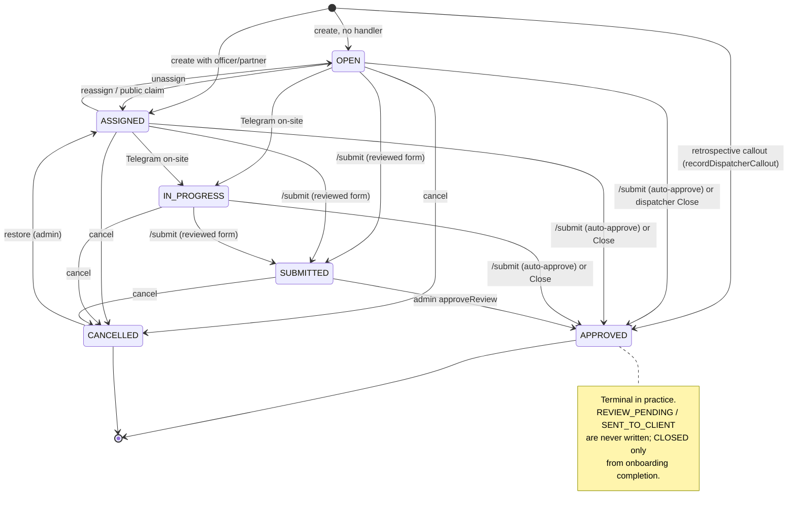

# Dispatch, Jobs & Alarms

> One universal `Job` record backs every callout, patrol, lock/unlock, VPI and alarm response; the dispatch board shows live work, jobs are created forwards (scheduled/assigned) or backwards (retrospective callout), and alarm-response jobs spin off a linked `AlarmEvent`.

## Purpose & scope

- The `Job` is the spine of operations: **every attended activity is a job** in the operator's mental model, even recurring patrols (which are actually `PatrolVisit` rows projected onto the board — see below).
- This doc covers: the `Job` and `AlarmEvent` models, the `JobStatus` state machine, the dispatch board (`/dispatch`), job creation (dispatcher forward-dispatch, retrospective callout, Telegram bot, schedule materialiser), the public claim board (`/jobs`), the alarm detail view (`/alarms/[id]`), the reassign/cancel/close/restore actions, and the admin-managed `JobTypeOption` / `JobSourceOption` picker labels.
- **Out of scope (cross-referenced):** the `/submit` officer form + admin review queue that turns a job `SUBMITTED → APPROVED` and issues a `ClientReport` → [`07-officer-reports-forms.md`](./07-officer-reports-forms.md); recurring `PatrolSchedule` / `LockUnlockSchedule` / `Shift` / rota mechanics → [`05-patrols-shifts-rota.md`](./05-patrols-shifts-rota.md); the billing/pay snapshot maths → [`09-finance-billing-pay.md`](./09-finance-billing-pay.md); the notification queue → [`10-notifications.md`](./10-notifications.md); the bot's intent router and callout parser → [`11-telegram-bot.md`](./11-telegram-bot.md).

---

## Data model

Read `prisma/schema.prisma`. The four models this module owns are **`Job`**, **`AlarmEvent`**, **`JobTypeOption`**, **`JobSourceOption`**. `PatrolVisit` and `Shift` are owned by [`05`](./05-patrols-shifts-rota.md) but appear on the dispatch board.

### `Job` — key fields

| Field | Type / nullability | Notes |
|---|---|---|
| `id` | uuid PK | |
| `type` | `JobType` (enum, storage primitive) | Display label resolved via `JobTypeOption`, not the enum. |
| `typeLabel` | `String?` | Sub-type alias the operator picked (e.g. "Intruder alarm" under `ALARM_RESPONSE`). Null → canonical label for `type`. |
| `source` | `JobSource` | |
| `status` | `JobStatus` default `OPEN` | See lifecycle. |
| `priority` | `AlarmPriority` default `MEDIUM` | Reused for all jobs, not just alarms. |
| `siteId` → `site` | `String?` | Nullable in schema; **every real creation path sets it**. |
| `customerId` → `customer` | `String?` | Copied from `Site.customerId` at create. May be null. |
| `partnerId` → `partner` | `String?` | **Partner-as-customer** link. Copied from `Site.partnerId` at create. |
| `handledByPartnerId` → `handledByPartner` (`"JobHandlerPartner"`) | `String?` | **Partner-as-subcontractor** link — we sub the job out. **Opposite meaning to `partnerId`.** |
| `handledByPartnerOfficerId` | `String?` | Partner's own-roster officer (Phase 2 partner-recorded jobs). |
| `partnerChargeToUsAmount`, `partnerOfficerPayAmount` | `Decimal?` | Partner rate snapshot (partner-recorded jobs). |
| `recordedByPartner` | `Boolean` default false | True iff created from `/partner/activities/new`. |
| `responderType` | `ResponderType?` | `INTERNAL_OFFICER` / `PARTNER` / `EXTERNAL_NAMED`. |
| `assignedToUserId` → `assignedTo` (`"JobResponderUser"`) | `String?` | Internal officer. |
| `externalResponder` | `String?` | Free-text name — partner's guard, or the public claimant. |
| `handedOffAt` | `DateTime?` | When we gave a sub'd job to the partner. |
| `lastPartnerChaseAt` | `DateTime?` | Drives the 15-min partner chase cadence (shift-checks cron). |
| `alarmEventId` → `alarmEvent` | `String?` **@unique** | 1:1 to `AlarmEvent`. Set only for alarm-response jobs. |
| `patrolVisitId` → `patrolVisit` | `String?` **@unique** | 1:1 link when a visit spawns a job (rare; visits usually stand alone). |
| `shiftId` → `shift` | `String?` | Link to a guarding/dog shift. |
| `onboardingPipelineId` | `String?` | Setup jobs during site onboarding. |
| `scheduledFor` | `DateTime?` | **The attribution anchor** (see `activityWhen`). |
| `startedAt`, `completedAt` | `DateTime?` | On-site / off-site stamps. |
| `lat`, `lng`, `locatedAt` | `Float?/DateTime?` | Officer location at submit/complete (web geo or Telegram share). |
| `cancelledAt`, `cancelledByUserId` → `cancelledBy`, `statusBeforeCancel` | audit | `statusBeforeCancel` lets Restore return the job precisely. |
| `reportedViaPartnerApp` | `Boolean` default false | **Partner-as-customer flag** → no `/submit`, no `ClientReport`. |
| `partnerReportRef` | `String?` | Paste the partner's PDF/activation ref when they report back. |
| `recordedByUserId` → `recordedBy` (`"JobRecordedBy"`) | `String?` | Set when a dispatcher typed the job in directly (retrospective callout / bot). |
| `excludeFromClientReport` | `Boolean` default false | Keep a callout internal (off the daily client email). |
| `billedAmount/Currency/At`, `paidAmount/Currency/At`, `payRateUnit` | finance snapshot | Same shape as `PatrolVisit`/`Shift` so `/finance` aggregates uniformly. See [`09`](./09-finance-billing-pay.md). |
| `notes`, `createdAt`, `updatedAt` | | |

Relations out: `formSubmissions FormSubmission[]` (a job can gather several submissions; `FormSubmission.jobId` is `onDelete: SetNull`). Indexes on `[siteId,status]`, `[assignedToUserId,status]`, `customerId`, `partnerId`, `handledByPartnerId`, `scheduledFor`, `status`, `shiftId`.

### `AlarmEvent` — key fields

| Field | Type | Notes |
|---|---|---|
| `id` | uuid PK | |
| `siteId` → `site` | required | |
| `source` | `AlarmSource` | `ARC_EMAIL`/`ARC_PHONE`/`PARTNER_EMAIL`/`PARTNER_PHONE`/`CUSTOMER_PHONE`/`MANUAL`/`WEBHOOK`. |
| `receivedAt` | `DateTime` default now | |
| `rawSubject`, `rawBody`, `zone` | `String?` | Pasted email / dispatcher notes. |
| `priority` | `AlarmPriority` default `MEDIUM` | |
| `assignedToId` → `assignedTo` (`"AlarmAssignedTo"`) | `String?` | Copied from the job's assignee at create. |
| `outcome` | `AlarmOutcome?` | `FALSE_ALARM`/`GENUINE`/`RESOLVED`/`ESCALATED_TO_POLICE`/`OTHER`. **Never written in production** — see gotchas. |
| `closedAt` | `DateTime?` | Also never written — response-time display stays null. |
| `job` | `Job?` | Back-relation of `Job.alarmEventId`. |

`AlarmEvent` is a **byproduct** of an alarm-response job, not an independent intake. It has no list page, no create form, and no mutation action.

### `JobTypeOption` / `JobSourceOption` — picker labels

Admin-managed label + ordering rows over the fixed enums (`code JobType`/`JobSource`, `label`, `description`, `sortOrder`, `active`). The enum stays the DB storage primitive; these tables only drive dropdown text/order and display labels. Managed at `/admin/options`. See `src/lib/labels.ts` for resolution rules.

### Enums used

- **`JobType`**: `ALARM_RESPONSE, PATROL, LOCK, UNLOCK, KEY_COLLECTION, KEY_DROPOFF, SURVEY, VPI, ADHOC, STATIC_GUARDING_SHIFT, DOG_HANDLER_SHIFT`. (`SURVEY` + the two `_SHIFT` types are excluded from the dispatch pickers.)
- **`JobSource`**: `SCHEDULED, ALARM, PARTNER_REQUEST, CUSTOMER_REQUEST, ONBOARDING, AD_HOC`.
- **`JobStatus`**: `OPEN, ASSIGNED, IN_PROGRESS, SUBMITTED, REVIEW_PENDING, APPROVED, SENT_TO_CLIENT, CLOSED, CANCELLED`.
- **`ResponderType`**: `INTERNAL_OFFICER, PARTNER, EXTERNAL_NAMED`.
- **`AlarmSource`**: `ARC_EMAIL, ARC_PHONE, PARTNER_EMAIL, PARTNER_PHONE, CUSTOMER_PHONE, MANUAL, WEBHOOK`.
- **`AlarmPriority`**: `LOW, MEDIUM, HIGH`.
- **`AlarmOutcome`**: `FALSE_ALARM, GENUINE, RESOLVED, ESCALATED_TO_POLICE, OTHER`.

---

## The Job lifecycle

`JobStatus` has 9 values but the **dispatch/jobs flow only exercises 6**: `OPEN, ASSIGNED, IN_PROGRESS, SUBMITTED, APPROVED, CANCELLED`. `REVIEW_PENDING` and `SENT_TO_CLIENT` are defined but never written by any code path; `CLOSED` is written only by onboarding-pipeline completion. Terminal states in practice are **`APPROVED`** and **`CANCELLED`** (see gotchas). There is **no formal state-machine module** — transitions are enforced by scattered guards in `src/lib/jobActions.ts`, `/api/submissions`, and the review action.

| From | To | Trigger (fn · file) | Fields stamped |
|---|---|---|---|
| — | `OPEN` | create with no handler — `createJob` `dispatch/_actions.ts`, `createBotCallout` `lib/callouts.ts`, `maybeCreateLockUnlock` `lib/scheduleSync.ts` | `scheduledFor`, billing snapshot |
| — | `ASSIGNED` | create with officer or partner named — same fns | + `assignedToUserId`/`handledByPartnerId`, `responderType`, pay snapshot (if officer) |
| — | `APPROVED` | retrospective callout — `recordDispatcherCallout` `dispatch/callouts/_actions.ts` | `startedAt`, `completedAt`, `recordedByUserId`, billing+pay |
| `OPEN` ↔ `ASSIGNED` | assign / unassign officer | `reassignJobCore` `lib/jobActions.ts` (via `reassignJob` `patrols/_actions.ts`) | `assignedToUserId`; status flips **only pre-start** |
| `OPEN` | `ASSIGNED` | public claim — `claimJob` `jobs/_actions.ts` | `responderType=EXTERNAL_NAMED`, `externalResponder`; atomic `updateMany` |
| `OPEN`/`ASSIGNED` | `IN_PROGRESS` | officer taps **On-site** in Telegram — `api/telegram/webhook` | `startedAt` (if unset) |
| `OPEN`/`ASSIGNED`/`IN_PROGRESS` | `SUBMITTED` | `/submit` for a **reviewed** form (`ALARM_RESPONSE`/`ADHOC`/`KEY_*`) — `api/submissions` | `startedAt` (from `arrivedAt`), location |
| `OPEN`/`ASSIGNED`/`IN_PROGRESS` | `APPROVED` | `/submit` for an **auto-approve** form (`PATROL`/`VPI`/`LOCK`/`UNLOCK`) — `api/submissions` | `completedAt`, `startedAt`, billing+pay snapshot |
| `SUBMITTED` | `APPROVED` | admin approves in review queue — `approveReview` `admin/reports/_actions.ts` | `completedAt`; creates `ClientReport` if eligible; billing+pay |
| pre-review (`OPEN`/`ASSIGNED`/`IN_PROGRESS`/`SUBMITTED`) | `APPROVED` | dispatcher **Close** (officer told them by phone) — `closeJobCore` `lib/jobActions.ts` | `startedAt`/`completedAt` (if unset), audit note, billing+pay |
| any non-terminal | `CANCELLED` | **Cancel** — `cancelJobCore` `lib/jobActions.ts` | `cancelledAt`, `cancelledByUserId`, `statusBeforeCancel`; **nulls out billing+pay**. Blocked if already `CLOSED`/`SENT_TO_CLIENT`. |
| `CANCELLED` | `statusBeforeCancel` (else `OPEN`/`ASSIGNED`) | **Restore** (admin) — `restoreJob` `dispatch/_actions.ts` | clears cancel fields; **re-snapshots** billing+pay |

**`VisitStatus` (for the projected patrol rows on the board)** runs a parallel machine — `PENDING → IN_PROGRESS → COMPLETED`, with `LATE`/`MISSED` set by the `visit-statuses` cron and `CANCELLED` by the cancel action. Detail in [`05`](./05-patrols-shifts-rota.md).

---

## Key files

- `prisma/schema.prisma` — `Job`, `AlarmEvent`, `JobTypeOption`, `JobSourceOption` models + the enums above.
- `src/lib/jobActions.ts` — **auth-free core transitions**: `reassignJobCore`, `cancelJobCore`, `closeJobCore`, `completeVisitCore`. Wrapped by server actions (which add `requireStaff` + `revalidatePath`) and called directly by the Telegram webhook. Single source of truth for state + money reversal.
- `src/lib/callouts.ts` — `createBotCallout`: forward-dispatch job from bot-resolved ids → lands `ASSIGNED`/`OPEN`, mirrors `createJob`.
- `src/lib/calloutTypes.ts` — pure `BOT_CALLOUT_TYPES`/`BOT_CALLOUT_SOURCES` + `BotCalloutData` type; Prisma-free so the resolver stays unit-testable.
- `src/lib/dispatcherCallout.ts` — zod `CalloutInput` + `checkBackdateAllowed` (30-day cap, admin bypass) for the retrospective callout form.
- `src/lib/activityWhen.ts` — canonical "when": `jobWhen`/`visitWhen`/`shiftWhen` (display) and `jobScheduledRange`/`visitScheduledRange`/`shiftScheduledRange` (Prisma where-fragments). **Scheduled date, never `createdAt`.**
- `src/lib/dayActivities.ts` — `loadDayActivities` / `loadNowSnapshot` merge jobs+visits+shifts for the Telegram day-rundown / "on now" views.
- `src/lib/scheduleSync.ts` — `materializeLockUnlockJobs` (→ `LOCK`/`UNLOCK` Jobs) and `materializePatrolVisits` (→ `PatrolVisit` rows). Idempotent; shared by cron + the manual Sync button.
- `src/lib/labels.ts` — `listJobTypeOptions`/`listJobSourceOptions` (pickers), `getJobTypeLabels`/`getJobSourceLabels` (display), `ensureOptionsSeeded`.
- `src/lib/billing.ts` — `jobTypeToRateService`, `billForSite`, `payForOfficer`, `snapshotJobFinanceIfNeeded`, `applyBillingToJob`/`applyPayToJob`. See [`09`](./09-finance-billing-pay.md).
- `src/app/(app)/dispatch/page.tsx` — the live board: bucket filters, KPI strip, live map, merged Job+Visit rows, 14-day analytics.
- `src/app/(app)/dispatch/_actions.ts` — `createJob`, `closeJob`, `cancelJob`, `restoreJob`, `updateJob`, `syncSchedulesNow`.
- `src/app/(app)/dispatch/[id]/page.tsx` + `[id]/edit/page.tsx` — job detail (read + action buttons) and admin edit form.
- `src/app/(app)/dispatch/new/page.tsx` + `_components/NewJobForm.tsx` — forward-dispatch "New job" form.
- `src/app/(app)/dispatch/callouts/new/page.tsx` + `_actions.ts` + `_components/CalloutForm.tsx` — retrospective "Record callout".
- `src/app/(app)/dispatch/_components/{ReassignOfficer,CancelActivityButton,CloseActivityButton,RestoreActivityButton,EditJobForm,ActivityCard}.tsx` — row-level controls, reused on `/activities`.
- `src/app/(app)/patrols/_actions.ts` — `reassignJob`, `reassignVisit`, `closePatrolVisit`, `cancelPatrolVisit`, `restorePatrolVisit` (the visit twins of the job actions live here).
- `src/app/(app)/alarms/[id]/page.tsx` — read-only alarm-event detail.
- `src/app/(app)/activities/page.tsx` — the unified history: jobs + visits + shifts + orphan submissions, filtered by scheduled-date windows.
- `src/app/jobs/{page.tsx,[id]/page.tsx,[id]/ClaimForm.tsx,_actions.ts}` — **public** open-jobs claim board.
- `src/app/api/submissions/route.ts` — `/submit` POST: creates `FormSubmission` + `ReportReview` and drives job `SUBMITTED`/`APPROVED`.
- `src/app/api/telegram/webhook/route.ts` — bot on-site/close/cancel/reassign + callout confirm (`createBotCallout`).
- `src/app/api/cron/{lockunlock-jobs,patrol-visits,visit-statuses}/route.ts` — schedule materialisers + the LATE/MISSED sweep.
- `src/app/(app)/admin/options/{page.tsx,_actions.ts,_components/OptionsManager.tsx}` — picker-label CRUD.

---

## Core flows

### (a) Dispatcher creates a forward job — `/dispatch/new`

1. Page (`dispatch/new/page.tsx`) loads active sites, assignable users (`OFFICER` **+** `DISPATCHER`), subcontractor partners (`SUBCONTRACTOR`/`BOTH`), and picker options; `STATIC_GUARDING_SHIFT`/`DOG_HANDLER_SHIFT` are filtered out.
2. `NewJobForm` posts to `createJob` (`dispatch/_actions.ts`). It carries a hidden `type` (enum code) + `typeLabel` (chosen option label), the site, priority, `scheduledFor`, and a `handlerKind` radio (`officer`|`partner`). Alarm fields appear only when `type === ALARM_RESPONSE`.
3. `createJob`: `requireStaff` → zod `NewJobInput.safeParse` → verify site active → if `handlerKind=partner`, verify the partner is active **and** role `SUBCONTRACTOR`/`BOTH`.
4. If `ALARM_RESPONSE`: create the `AlarmEvent` first (source/zone/priority/rawSubject/rawBody, `assignedToId` = officer), keep its id.
5. Create the `Job`: status `ASSIGNED` if an officer or partner is named else `OPEN`; `customerId`/`partnerId` copied from the site; `responderType` = `PARTNER`|`INTERNAL_OFFICER`; `handedOffAt`, `externalResponder` (= partner guard name), `alarmEventId`, `scheduledFor`, `reportedViaPartnerApp`, `partnerReportRef`, `notes`.
6. Billing snapshot via `billForSite`; officer-pay snapshot via `payForOfficer` **only when an internal officer is assigned** (sub'd jobs leave pay null). Accounting date = `scheduledFor`.
7. Fire-and-forget: `notifyAlarmReceived(alarmEventId)` (WhatsApp + Telegram broadcast) and `notifyAssignedOfficerOfJob` (DM the assignee). `revalidatePath('/dispatch')` + site page → `redirect('/dispatch')`.

### (b) Bot creates a callout — Telegram

1. Dispatcher messages the bot; `lib/telegramCallout` AI-parses + resolves names to ids, stashes a `TelegramCalloutDraft` (payload = `BotCalloutData`), and shows a Confirm/Cancel card.
2. On **Confirm**, `api/telegram/webhook` calls `createBotCallout(data, { id: draft.createdByUserId })` (`lib/callouts.ts`).
3. `createBotCallout` re-checks every id against the DB (site active, officer active, partner active + subcontractor role), creates an `AlarmEvent` with **`source=MANUAL`** for alarm types, creates the `Job` (`ASSIGNED` if handler set else `OPEN`, `recordedByUserId=me`), snapshots billing+pay, then fires `notifyAlarmReceived` / `notifyAssignedOfficerOfJob`. Returns a flat result the webhook renders as a reply.

### (c) Retrospective / record-callout — `/dispatch/callouts/new`

1. For work **already done** that skips the officer-form + review pipeline. Page loads active sites, `OFFICER`s (note: **not** dispatchers here), subcontractor partners, and a count of customer-only partners (to nudge role fixes). Types/sources are filtered to the callout subset.
2. `CalloutForm` pre-fills end=now, start=now−30min; posts to `recordDispatcherCallout` (`dispatch/callouts/_actions.ts`).
3. Validation via `lib/dispatcherCallout` `CalloutInput`: officer branch requires officer+`startedAt`+`completedAt`; partner branch requires the partner (times optional — often unknown until they report back). `checkBackdateAllowed` enforces the **30-day** cap (admin bypass), anchored on `startedAt` (officer) or `handedOffAt` (partner).
4. Creates the `Job` at **`status=APPROVED`** directly, with `recordedByUserId`, `excludeFromClientReport`, `partnerReportRef`. Billing snapshot always (we bill the customer regardless); officer pay only when our officer attended. Accounting date = `completedAt`. `redirect('/dispatch')`.

### (d) Reassign / cancel / close / restore

- **Reassign** — `ReassignOfficer` builds a `FormData` (`jobId`/`visitId` + `officerId`) and calls `reassignJob`/`reassignVisit` (`patrols/_actions.ts`). Jobs route through `reassignJobCore`, which sets `assignedToUserId` and **only flips `OPEN`↔`ASSIGNED` pre-start** (never overwrites `IN_PROGRESS`+). Pings the new assignee on Telegram. Offered only on live, non-partner-handled activities.
- **Close** — `CloseActivityButton` → `closeJob`/`closePatrolVisit`. `closeJobCore` is the dispatcher "complete on the officer's behalf": stamps `startedAt`/`completedAt` if missing, appends an audit note (`"Closed by dispatch (name) …"`), sets `APPROVED`, and calls `snapshotJobFinanceIfNeeded`. Idempotent; refuses on `CANCELLED`.
- **Cancel** — `CancelActivityButton` (behind the `Confirm` modal) → `cancelJob`/`cancelPatrolVisit`. `cancelJobCore` sets `CANCELLED`, records who/when, snapshots `statusBeforeCancel`, and **nulls all billing+pay fields**. Refuses on already-`CLOSED`/`SENT_TO_CLIENT`. Cancelled visits are not re-created by the nightly materialiser (dedupe is on exact `scheduledAt`).
- **Restore** — `RestoreActivityButton` → `restoreJob`/`restorePatrolVisit`. **Admin only** (`requireAdmin`). Returns the job to `statusBeforeCancel` (or infers `OPEN`/`ASSIGNED` for legacy cancels) and **re-runs the rate lookup** to re-apply billing+pay.
- **Edit** — `/dispatch/[id]/edit` → `updateJob` (`requireStaff`, dispatcher+admin). Corrects content (type/source/priority/times/handover/notes/`partnerReportRef`/`excludeFromClientReport`) but **not** status or finance; cancelled jobs are not editable.

### (e) Alarm received

There is **no automated alarm intake**. An `AlarmEvent` is only ever born alongside an alarm-response job:

1. Via `createJob` (dispatch form, `type=ALARM_RESPONSE`) — source/zone/rawSubject/rawBody captured from the operator; **or**
2. Via `createBotCallout` (Telegram, `type=ALARM_RESPONSE`) — `source=MANUAL`.

The `AlarmEvent` is linked 1:1 (`Job.alarmEventId`), surfaces on `/alarms/[id]` (read-only: site, timeline, assignee, the response job, raw email), and triggers `notifyAlarmReceived`. Parsing partner/ARC alarm emails into `AlarmEvent` rows is **not built** (matches the roadmap in `CLAUDE.md`).

---

## Business rules & invariants

- **A `Job` may have a `Customer`, a `Partner`, or neither.** Both fk's are nullable and copied from the site at create. Never assume a customer exists — the detail page falls back to `site.customer` / `site.partner`, and the review action only issues a `ClientReport` when a customer **with a contact email** exists.
- **Two opposite partner links.** `partnerId` = partner-as-customer (their site, we subcontract for them). `handledByPartnerId` = partner-as-subcontractor (our job, we sub it out). A partner-handled job carries `responderType=PARTNER`, no internal officer, and no officer-pay snapshot (their cost lives in `partnerChargeToUsAmount`).
- **`reportedViaPartnerApp = true` ⇒ no `/submit`, no `ClientReport`.** The officer fills the partner's app; we hold only the stub job for pay/audit. The board hides reassign/cancel controls for partner-handled rows (no internal officer to move).
- **Scheduled-date attribution, never `createdAt`.** Boards, the activities log, finance windows, and Telegram day rundowns all anchor on `scheduledFor` (job) / `scheduleDate` (visit) / `scheduledStartsAt` (shift), falling back to completion only when there is no schedule. A job for the 2nd, entered on the 4th, belongs to the 2nd everywhere. Enforced by `src/lib/activityWhen.ts`.
- **`responderType` semantics:** `INTERNAL_OFFICER` (our officer; may be unassigned and left `OPEN` for claim), `PARTNER` (sub'd out; `externalResponder` = their guard's name), `EXTERNAL_NAMED` (claimed on the public `/jobs` board; `externalResponder` = the free-text name typed by the claimant).
- **Partner handlers must be `SUBCONTRACTOR` or `BOTH`.** Enforced in `createJob`, `updateJob`, `recordDispatcherCallout`, and `createBotCallout`.
- **Billing is snapshotted at create; officer pay only when we attend.** Cancel reverses both; restore re-applies. Auto-approve `/submit` forms and the review approval also snapshot via `snapshotJobFinanceIfNeeded`.
- **Public claim is race-safe.** `claimJob` uses `updateMany` with `WHERE status=OPEN AND assignedToUserId IS NULL AND externalResponder IS NULL`; `count===0` ⇒ already claimed. Rate-limited (30/min/IP).
- **Reassign never overwrites work in progress** — it flips status only when the job is `OPEN`/`ASSIGNED`.
- **Alarm-response jobs always create an `AlarmEvent`; `priority` is the alarm's priority.**
- **`typeLabel` is display-only.** In `getJobTypeLabels`, a code with exactly one option row is treated as an admin rename; a code with several rows keeps the canonical default (the extras are picker-only aliases so they can't hijack list/board labels).

---

## Entry points

**Server actions**

| Fn | File | Does |
|---|---|---|
| `createJob` | `dispatch/_actions.ts` | Forward-dispatch job (`OPEN`/`ASSIGNED`); alarm event; billing/pay; notify. |
| `closeJob` | `dispatch/_actions.ts` | Dispatcher complete-on-behalf → `APPROVED` (wraps `closeJobCore`). |
| `cancelJob` | `dispatch/_actions.ts` | → `CANCELLED`, reverse finance (wraps `cancelJobCore`). |
| `restoreJob` | `dispatch/_actions.ts` | **Admin.** Un-cancel + re-snapshot finance. |
| `updateJob` | `dispatch/_actions.ts` | Edit job content (not status/finance). |
| `syncSchedulesNow` | `dispatch/_actions.ts` | Manual trigger of the materialisers (today+tomorrow); returns diagnostics for the Sync button. |
| `recordDispatcherCallout` | `dispatch/callouts/_actions.ts` | Retrospective callout → `APPROVED`. |
| `reassignJob` / `reassignVisit` | `patrols/_actions.ts` | Change officer (job via `reassignJobCore`). |
| `closePatrolVisit` / `cancelPatrolVisit` / `restorePatrolVisit` | `patrols/_actions.ts` | Visit twins of the job actions. |
| `claimJob` | `jobs/_actions.ts` | **Public.** Atomic claim → `ASSIGNED`/`EXTERNAL_NAMED`, redirect to `/submit`. |
| `approveReview` | `admin/reports/_actions.ts` | `SUBMITTED → APPROVED`, create `ClientReport`, snapshot finance (see [`07`](./07-officer-reports-forms.md)). |
| `create/update/delete/toggle JobTypeOption` & `…JobSourceOption` | `admin/options/_actions.ts` | **Admin.** Picker-label CRUD; revalidates dispatch/jobs pages. |

**API routes**

| Route | Method | Does |
|---|---|---|
| `/api/submissions` | POST | `/submit` handler: `FormSubmission` + `ReportReview`; drives job `SUBMITTED` (reviewed) or `APPROVED` (auto-approve) and completes linked visits. |
| `/api/visits/[id]/on-site` | POST | Visit → `IN_PROGRESS`, self-assign if unassigned, GPS. |
| `/api/telegram/webhook` | POST | Bot: on-site (job→`IN_PROGRESS`), close/complete, cancel, reassign, callout confirm (`createBotCallout`). |

**Crons** (Vercel, secret-gated via `isAuthorisedCron`; see [`13-crons.md`] and [`05`](./05-patrols-shifts-rota.md))

| Route | Cadence | Does |
|---|---|---|
| `/api/cron/lockunlock-jobs` | daily | `materializeLockUnlockJobs` → `LOCK`/`UNLOCK` Jobs for today+tomorrow. |
| `/api/cron/patrol-visits` | daily | `materializePatrolVisits` → `PatrolVisit` rows for today+tomorrow. |
| `/api/cron/visit-statuses` | hourly | `PENDING`→`LATE` (+1h), →`MISSED` (+24h); queues notifications. |

---

## Extension points & gotchas

- **Dead enum states.** `REVIEW_PENDING` and `SENT_TO_CLIENT` are in `JobStatus` and appear in read-side guards/tone maps but **no code ever writes them**. Issuing/sending a `ClientReport` does **not** flip the job to `SENT_TO_CLIENT` — it stays `APPROVED`. `CLOSED` is written only by onboarding-pipeline completion (`onboarding/_actions.ts`), not by the dispatch flow. A rebuild should either wire these up or drop them.
- **Alarm events are write-once.** No action ever updates an `AlarmEvent`, so `outcome` and `closedAt` are never populated in production — the `/alarms/[id]` "N min response" chip never renders, and there's no way to record a false alarm/genuine outcome. There is also no alarm **list** page and no assign/outcome UI. Prime area for a rebuild.
- **`IN_PROGRESS` is Telegram-only for jobs.** The web/mobile UI has no "start job" button; only the bot's **On-site** tap moves a job to `IN_PROGRESS`. A job completed via `/submit` jumps straight `OPEN/ASSIGNED → SUBMITTED/APPROVED`, so `IN_PROGRESS` is often skipped and `startedAt` comes from the form's `arrivedAt`. (Visits *do* have a web on-site endpoint.)
- **Patrols are visits, not jobs — but appear as jobs.** `materializePatrolVisits` writes `PatrolVisit` rows; the dispatch board projects them into the job list (`__visitId` discriminates, routing edit/cancel/reassign to the visit actions and detail to `/patrols/visits/[id]`). Lock/unlock **are** real Jobs. Don't assume a board row is a `Job`.
- **No shared state machine.** Transition legality is duplicated across `jobActions.ts`, `api/submissions`, `approveReview`, and the webhook, using `as any` status casts throughout. Easy to drift; a rebuild should centralise it.
- **Reassign passes `FormData`, not typed args** — `ReassignOfficer` constructs it client-side. The other row actions (`cancelJob`, `closeJob`, `restoreJob`) take a plain `jobId` string and return `{ ok, error? }`.
- **Two officer-picker populations differ:** `/dispatch/new` and the board's reassign offer `OFFICER`+`DISPATCHER`; `/dispatch/callouts/new` offers `OFFICER` only. Intentional but easy to trip over.
- **Picker labels can hide a whole type.** Deleting/deactivating every `JobTypeOption` for a code removes it from the pickers (existing jobs keep a humanised fallback label). The enum is unchanged — you cannot add a genuinely new category from `/admin/options`, only relabel/reorder/alias.
- **Materialiser idempotency keys.** Lock/unlock dedupe on `(siteId, type, source=SCHEDULED, scheduledFor within the UK day)`; patrol visits dedupe on exact `(patrolScheduleId, scheduledAt)`. Changing a schedule's time creates a *new* row rather than moving the old one.
- **Partner-chase loop.** `Job.lastPartnerChaseAt` + the shift-checks cron nag dispatch every 15 min about a sub'd job until it's closed/cancelled or `partnerReportRef` is filled — remember to set the ref when logging the partner's report.
